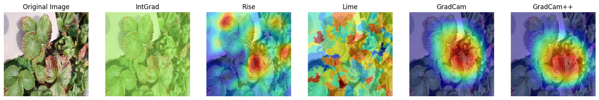

# Explainable AI (XAI) – Plant Disease Classification

This repository contains the Explainable AI (XAI) project, carried out as part of a 30-hour course in Explainable Artificial Intelligence (2023-2024) organized by:

- Department of Informatics, University of Pisa; 
- National PhD Course in Artificial Intelligence.

The course focuses on:
- Motivations behind XAI;
- Core XAI methods and libraries;
- Open research challenges in XAI.

## Project Overview
Plant disease classification from images presents several key challenges:

- Early detection during initial phases of infection;
- Detection in non-homogenous and complex backgrounds;
- Detection on both single and multiple overlapping leaves.

To address these challenges, we trained multiple deep learning models for plant disease classification from images and analyzed their detection capabilities using post-hoc Explainable AI (XAI) techniques, including: **Integrated Gradients (IntGrad)**, **LIME (Local Interpretable Model-agnostic Explanations)** and **Grad-CAM++**.

These methods enable the interpretation of model predictions by highlighting the most relevant image regions contributing to each classification decision.

